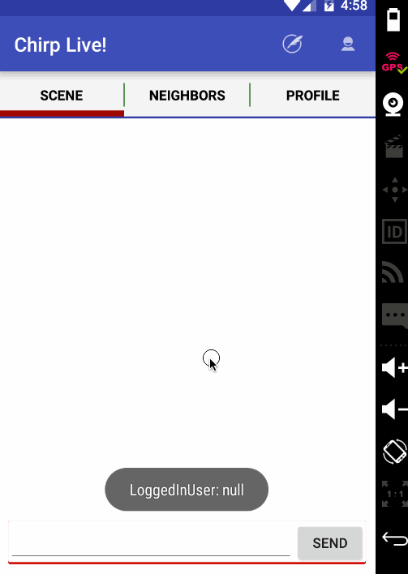

# Chirp

**Chirp** is a mobile-only pure-proximity based Android app platform for people to interact with people around them. If you have a question to ask about the neighborhood you are in, or about a new place you are visiting, or at an event, this platform is a great way to break the ice, to get connected and stay connected.

## User Stories

*Required User Stories:*
* [x] Login with Facebook
* [x] Login with Twitter
* [x] Sign up and Sign in
* [x] Get location updates
* [x] Associate last known or current location with each user
* [x] Get all other users around current user (within certain radius)
* [x] Virtual room: Send broadcast message to server
  * [x] Client UI
  * [x] Server to receive the message
  * [x] Comms to Server
* [x] Virtual room: Poll messages from server
  * [x] Client UI
  * [x] Server's REST API for polling
  * [x] Polling from Server (with count and max_id/since_id params) 

*Optional User Stories:*
* [x] Get profile info and populate on profile page 
* [ ] Interest based filtering
  * [ ] Client UI for setting filters (all in one group)
  * [ ] Apply filters while polling the server
* [ ] Message ID based rooms for active discussion of interested parties
* [ ] Vote up and Vote down to rate the messages
* [ ] Talk with at least one IoT machine (like turn on a thermostat/coffee machine saying "hi")
* [ ] Dynamic groups with passphrase
* [ ] Screen lock with a PIN/Pattern/Fingerprint
* [ ] Application walk-through to let users know different flows and features
* [ ] Oauth 2.0 based login with GitHub/Google+/LinkedIn/Amazon/AOL/Box/Dropbox/Foursquare/Instagram/PayPal/Stripe/Yammer/Yandex/Zendesk
* [ ] Guest login (???) or Go Anonymous option

*Production readiness plan:*
* [ ] Enable proguard; Deep Linking and Deep Searching of content

*Notes:*
* [ ] Minimum characters-limit on broadcast messages with smart checking.
* [ ] Prevent expletives, afap

## Status with app walkthrough

Wireframes: <a href="https://popapp.in/w/projects/56d7933afc8bc907550fc94c/mockups">here</a>.

*Sprint 2 current status:*

GIF created with [LiceCap](http://www.cockos.com/licecap/).

## Open-source libraries used

- [Android Async HTTP](https://github.com/loopj/android-async-http) - Simple asynchronous HTTP requests with JSON parsing
- [Glide](https://github.com/bumptech/glide/) - Image loading and caching library recommended for Android

## License

    Copyright [2016] Ravi Kumar Mandala

    Licensed under the Apache License, Version 2.0 (the "License");
    you may not use this file except in compliance with the License.
    You may obtain a copy of the License at

        http://www.apache.org/licenses/LICENSE-2.0

    Unless required by applicable law or agreed to in writing, software
    distributed under the License is distributed on an "AS IS" BASIS,
    WITHOUT WARRANTIES OR CONDITIONS OF ANY KIND, either express or implied.
    See the License for the specific language governing permissions and
    limitations under the License.